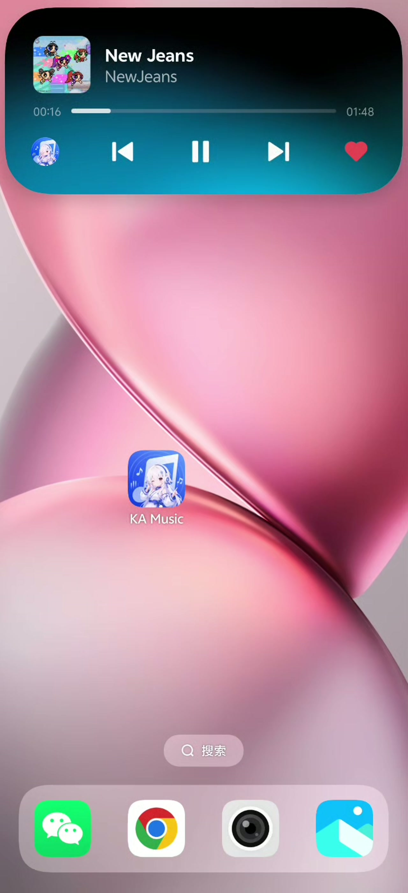

<p align="center">
  
</p>

<h1 align="center">KA Music VIVO</h1>

<p align="center">
  <strong>面向 VIVO OriginOS 原子随身听适配的第三方音乐客户端</strong>
  <br />
  基于 Flutter 构建 · 自动跟随上游版本 · Material You 设计
</p>

<p align="center">
  
  
  
  
</p>

<p align="center">
  
  
  
  
  
  
</p>

---

## 📖 简介

KA Music 是一个功能丰富的 **第三方音乐播放器**，使用 Flutter 框架构建，支持 Android、iOS、Windows、macOS、Linux 及 Web 六大平台。它提供跨平台音乐搜索、在线播放、歌词展示、下载缓存等完整的音乐体验，并采用 Material You 设计语言，支持深色模式和高度自定义主题。

> 🔌 该项目通过第三方 API 获取音乐数据，仅供学习交流使用。

---

## 📸 预览

<!-- TODO: 截图占位 — 请替换为实际截图 -->

## 功能截图

<p align="center">
  <a href="https://raw.githubusercontent.com/yaodao0yaodao/KA-Music-VIVO/vivo/screenshots/video_20260920_165848.mp4">
    
  </a>
  <br />
  <strong>原子随身听</strong>
  <br />
  <a href="https://raw.githubusercontent.com/yaodao0yaodao/KA-Music-VIVO/vivo/screenshots/video_20260920_165848.mp4">▶ 播放完整录屏（MP4）</a>
</p>

| 首页推荐 | 播放器 | 歌词 |
|:-------:|:------:|:----:|
|  |  |  |

| 个人库 | 搜索页 | 歌单详情 |
|:------:|:------:|:--------:|
|  |  |  |


---

## ✨ 核心功能

### 🎵 音乐播放

- **多音质切换** — 标准 (128K) / 高品质 (320K) / 无损 (FLAC) 三种音质
- **智能降级** — 播放失败时自动降级到更低音质重试，保证播放连续性
- **后台播放** — 支持 Android 通知栏控制及锁屏播放
- **播放模式** — 列表循环 / 随机播放 / 单曲循环
- **倍速播放** — 支持 0.5x ~ 3.0x 变速播放
- **音频均衡器** — 7 种预设音效（流行、摇滚、人声、低音、古典、电子、平板）
- **低音增强** — 0~100% 强度可调
- **定时停止** — 支持按时间或当前歌曲播放完毕后自动停止

### 🎤 歌词

- **逐字歌词** — 支持 KRC 格式的逐字高亮歌词
- **歌词翻译** — 支持翻译和罗马音显示
- **桌面歌词** — 桌面端悬浮歌词窗口
- **歌词交互** — 双击跳转进度 / 长按复制 / 字体大小可调

### 🔍 搜索与发现

- **多平台搜索** — 支持酷狗 + 网易云音乐双源搜索
- **搜索建议** — 实时搜索联想
- **热搜关键词** — 分类展示热门搜索
- **搜索历史** — 本地保存，支持标签式快捷搜索
- **每日推荐** — 个性化歌曲推荐
- **推荐歌单** — 热门歌单浏览
- **FM 电台** — 推荐电台 + 分类电台

### 📚 音乐库管理

- **歌单管理** — 创建 / 收藏 / 重命名 / 排序 / 批量删除
- **歌单分享** — 一键复制歌单歌曲列表到剪贴板
- **歌单导入** — 通过 ID 导入他人歌单
- **歌单内搜索** — 快速查找歌单中的歌曲
- **收藏歌曲** — 我喜欢 / 收藏管理
- **云盘** — 个人云盘音乐存储
- **专辑商店** — 新专辑浏览

### 📥 下载与缓存

- **下载管理** — 支持并发下载、断点续传、进度追踪
- **播放缓存** — 自动缓存播放过的歌曲，LRU 策略上限 300MB
- **数据缓存** — SWR（Stale-While-Revalidate）策略，分级 TTL
- **缓存可视化** — 数据缓存 / 下载 / 播放缓存大小查看与清理

### 🎨 个性化

- **Material You** — 支持 Dynamic Color，8 种预设种子色
- **深色模式** — 跟随系统或手动切换
- **自定义背景** — 支持从相册选取图片作为全局背景，可调透明度
- **自定义 API** — 支持配置自定义 API 地址

### 📊 数据统计

- **播放历史** — 最近播放歌曲记录（最近 500 首）
- **播放统计** — 累计播放次数、听歌时长
- **Top 榜单** — 最常听歌手 / 歌曲 Top 10

---

## 🏗️ 技术栈

| 类别 | 技术 |
|---|---|
| **框架** | Flutter (SDK ^3.11.5) |
| **语言** | Dart |
| **音频播放** | `just_audio` — 低延迟音频引擎 |
| **后台播放** | `audio_service` — 通知栏控制 & 后台保活 |
| **音频焦点** | `audio_session` — 系统级音频焦点管理 |
| **HTTP** | `http` (API 请求) + `dio` (文件下载) |
| **持久化** | `shared_preferences` — 设置 & 缓存 |
| **状态管理** | `ChangeNotifier` + `AnimatedBuilder`（原生方案） |
| **路由** | Navigator 1.0 |
| **设计系统** | Material 3 (Material You) |
| **代码规范** | `flutter_lints` |

---

## 📐 架构设计

```
┌─────────────────────────────────────┐
│              UI Layer               │
│   Pages · Widgets · AppTheme        │
├─────────────────────────────────────┤
│           Controllers               │
│   Auth · Player · Download · Theme  │  ← ChangeNotifier
├─────────────────────────────────────┤
│            Services                 │
│   MusicApi · CacheService           │
│   DownloadService · AudioHandler    │
├─────────────────────────────────────┤
│              Core                   │
│   ApiClient (HTTP + 重试 + Session) │
├─────────────────────────────────────┤
│             Config                  │
│   AppConfig · Models                │
└─────────────────────────────────────┘
```

- **分层清晰** — UI → Controller → Service → Core，单向依赖
- **手动 DI** — 构造函数注入，无第三方 DI 框架
- **SWR 缓存** — 先返回缓存数据，后台刷新，失败回退缓存
- **自动重试** — 网络请求指数退避重试（2 次，500ms/1s）
- **Session 管理** — `X-Kg-Session-Id` 持久化，自动恢复登录

---

## 🚀 快速开始

### 环境要求

- Flutter SDK >= 3.11.5
- Dart SDK >= 3.11.5
- Android Studio / VS Code
- 目标平台对应的 SDK

### 安装与运行

```bash
# 克隆仓库
git clone <repo-url>
cd kgka_music_hl

# 安装依赖
flutter pub get

# 运行（选择目标平台）
flutter run          # 自动检测设备
flutter run -d android
flutter run -d ios
flutter run -d windows
flutter run -d macos
flutter run -d linux
flutter run -d chrome
```

### 编译环境变量

| 变量 | 说明 | 默认值 |
|---|---|---|
| `KA_MUSIC_API_BASE_URL` | 自定义默认 API 地址 | `https://music.api.hoilai.cn` |
| `KA_MUSIC_DEBUG_LYRICS` | 启用歌词调试日志 | `true` |

```bash
# 编译时指定环境变量示例
flutter run --dart-define=KA_MUSIC_API_BASE_URL=https://your-api.com
```

---

## 📁 项目结构

```
lib/
├── main.dart                 # 应用入口
├── assets/
│   └── logo.jpg              # App Logo
├── config/
│   └── app_config.dart       # 全局配置（API 地址、缓存大小等）
├── core/
│   └── api_client.dart       # HTTP 客户端（重试、Session）
├── controllers/
│   ├── auth_controller.dart  # 登录认证
│   ├── player_controller.dart# 播放引擎
│   ├── download_controller.dart # 下载管理
│   └── theme_controller.dart # 主题管理
├── models/
│   ├── music_models.dart     # 音乐领域模型
│   └── app_version.dart      # 版本更新模型
├── services/
│   ├── music_api.dart        # API 接口封装
│   ├── cache_service.dart    # 数据缓存（SWR）
│   ├── download_service.dart # 文件下载服务
│   ├── music_audio_handler.dart # 后台音频服务
│   └── ...                   # 其他服务
└── ui/
    ├── app_theme.dart        # 主题定义
    ├── adaptive_layout.dart  # 响应式布局
    ├── pages/                # 页面
    │   ├── home_page.dart    # 首页
    │   ├── player_page.dart  # 播放器
    │   ├── library_page.dart # 我的
    │   ├── search_page.dart  # 搜索
    │   └── ...               # 其他页面
    └── widgets/              # 可复用组件
        ├── mini_player.dart  # 迷你播放栏
        ├── artwork.dart      # 封面组件
        └── ...               # 其他组件
```

---

## 📝 更新日志

详细的版本更新日志请查看 [update.md](update.md)。

**v2.0.5** 主要更新：

- 播放历史 & 统计页面
- 搜索历史、缓存管理可视化
- 歌单排序 & 批量删除 & 分享 & 导入
- 智能音质降级 & 网络自动重试
- 封面加载 Shimmer 动画

---

## 📄 许可证

本项目仅供学习交流使用，请勿用于商业用途。

---

<p align="center">
  <sub>Made with XiaoMai and Flutter</sub>
</p>
